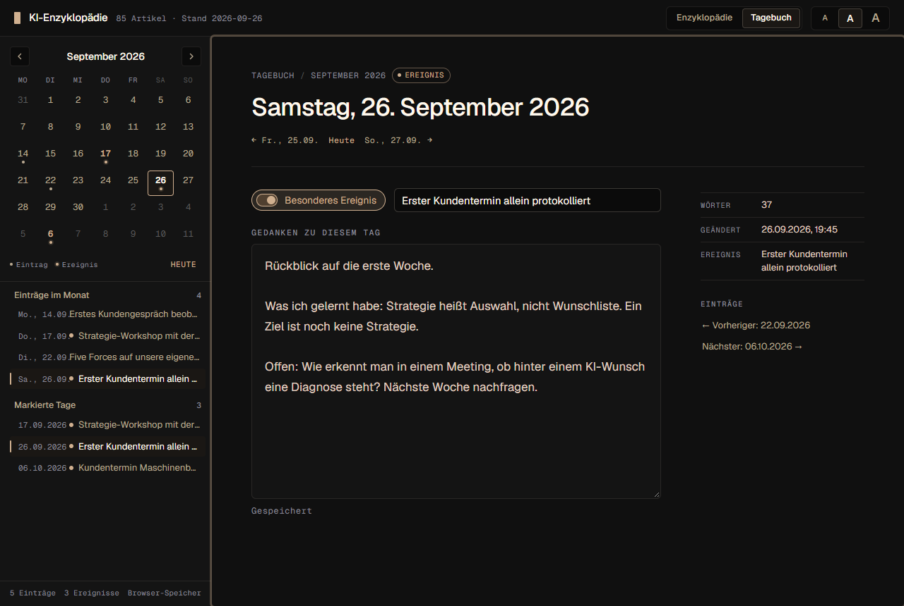
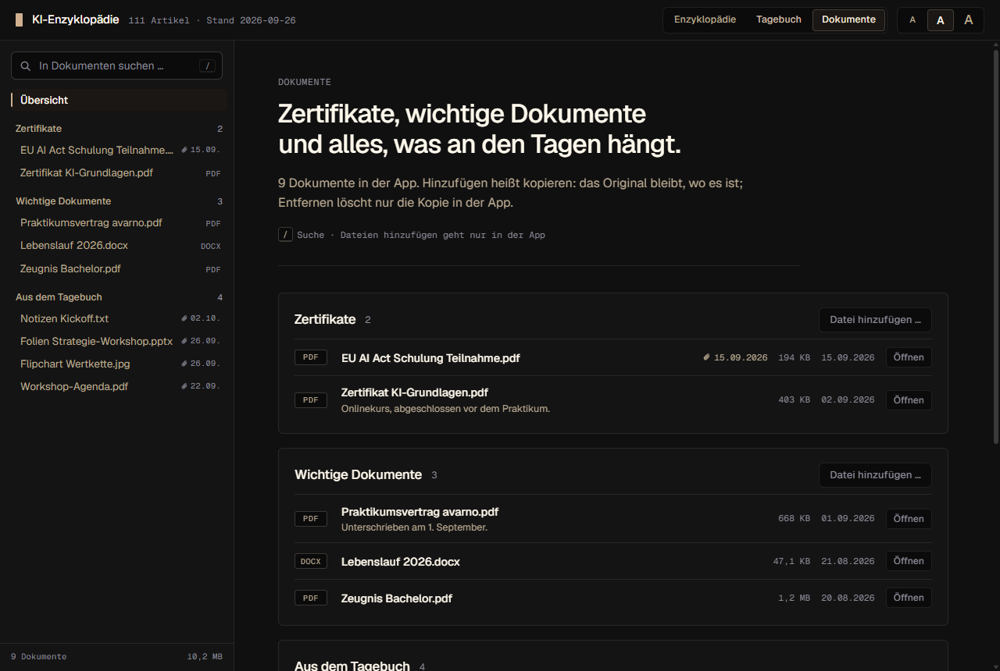
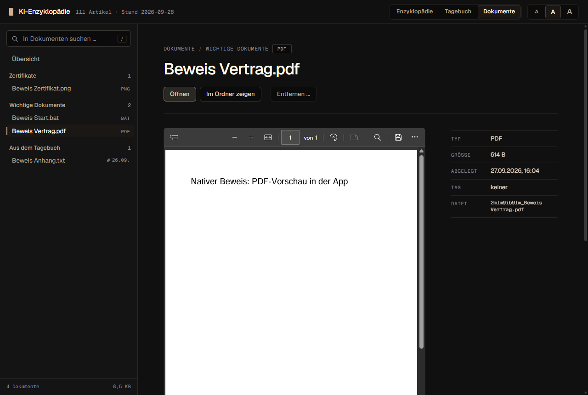
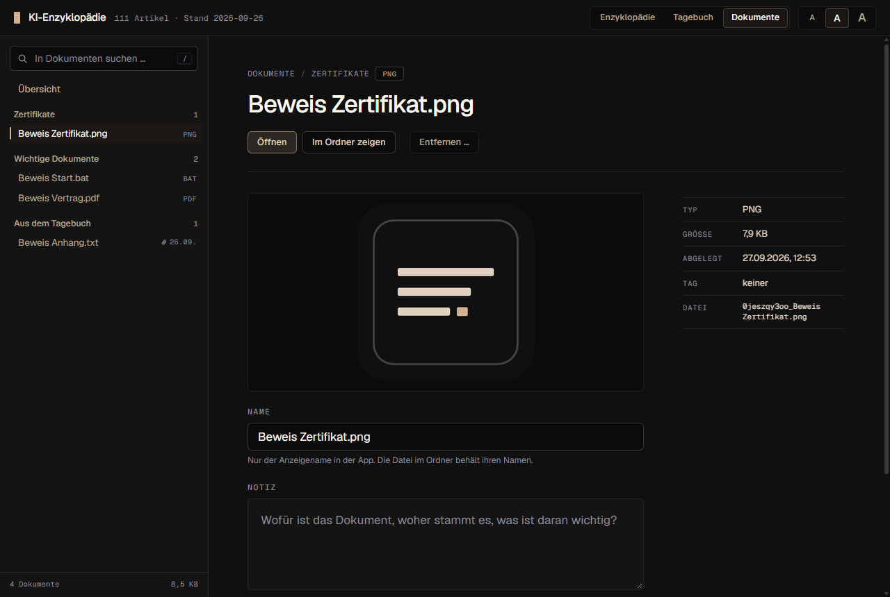
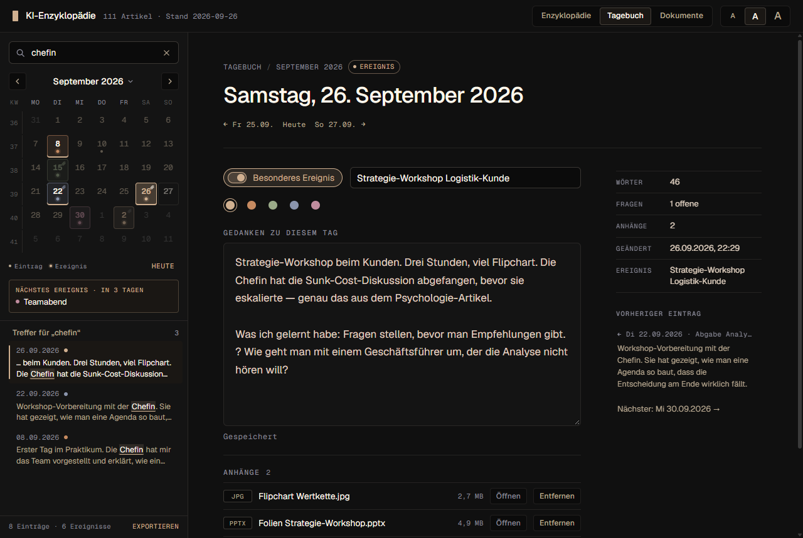
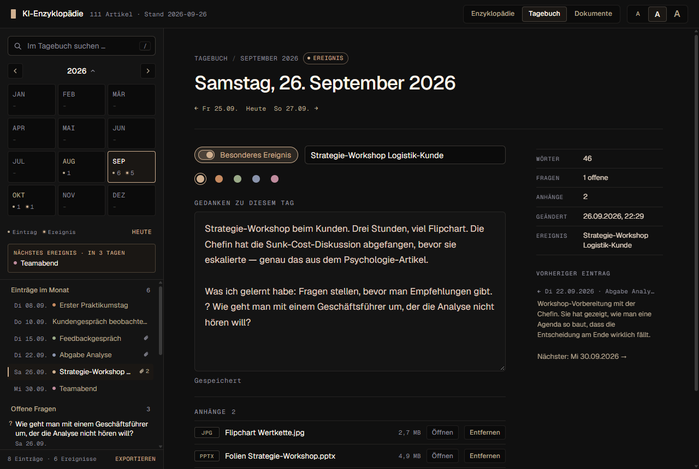
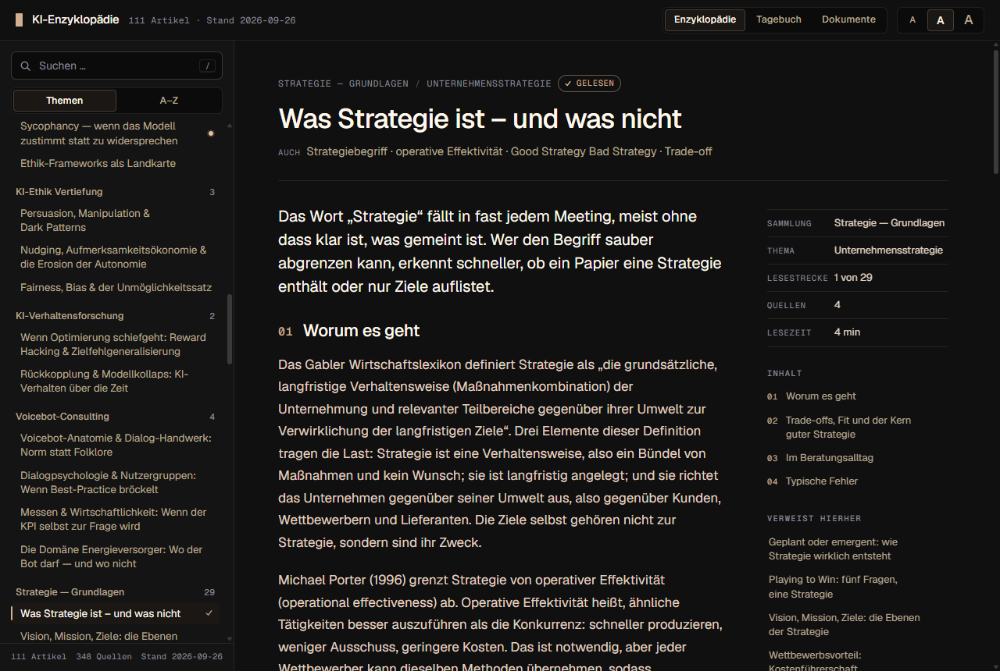
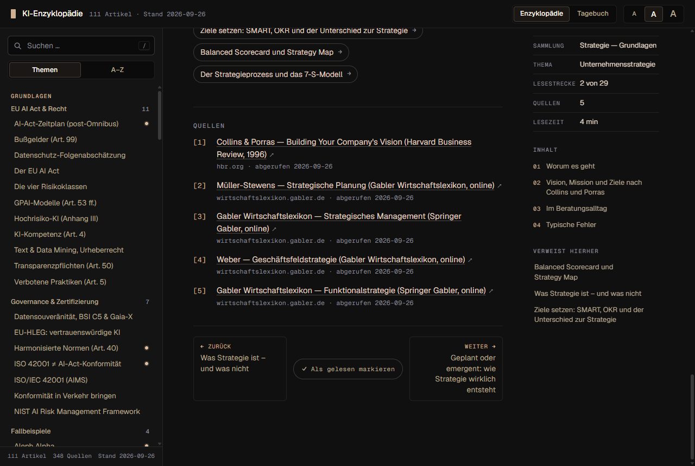
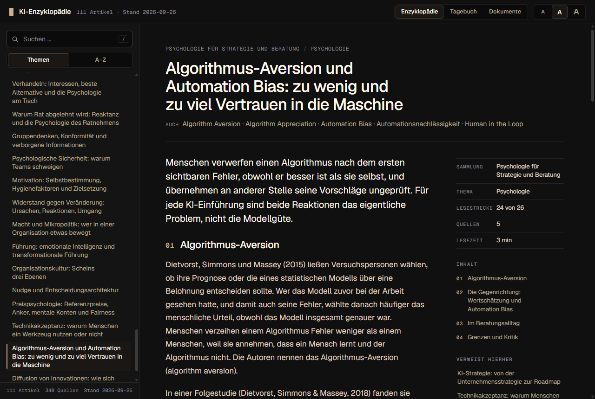

# KI-Enzyklopädie

Lese-App mit Tagebuch und Dokumentenablage: quellenbelegte, quervernetzte Artikel zu KI-Consulting, EU AI Act,
Governance & Zertifizierung, Fallbeispielen, KI-Ethik und Verhaltensforschung — und zwei
eigene Lesestrecken: **Strategie — Grundlagen** für den Einstieg in Unternehmensstrategie
und Beraterhandwerk sowie **Psychologie für Strategie und Beratung** (Entscheiden,
Gespräch, Organisation, Markt). 111 Artikel, 348 Quellen, jede Quelle mit Abrufdatum.
Dazu ein persönliches Tagebuch mit Kalender und ein Bereich für Zertifikate, wichtige
Dokumente und Anhänge zu einzelnen Tagen. Kein Quiz, kein RAG, kein Konto, kein Netz.

Zwei Inhaltsquellen:

- **Akademie-Export** (56 Artikel): der Enzyklopädie-Bereich der Akademie-App
  (`evenacadia-tech/probetag-akademie`), exportiert über `scripts/export-aus-akademie.mts`
  nach `src/inhalt/artikel.json`.
- **Eigene Sammlungen** (55 Artikel): von Hand gepflegte Artikel unter
  `src/inhalt/sammlungen/`. `strategie/` (29 Artikel) in fünf Blöcken (Was Strategie ist ·
  Umfeld und Branche analysieren · Geschäftsmodell und Kunde · Umsetzen und messen ·
  Beraterhandwerk); `psychologie/` (26 Artikel) in vier Blöcken (Denken und Entscheiden ·
  Menschen im Gespräch · Gruppen, Führung, Veränderung · Kunde, Markt, Technikakzeptanz,
  Abschluss „Befunde richtig lesen“). Jeder Artikel: 3–4 Abschnitte, 2–5 geprüfte
  Primärquellen, ein Beispiel aus dem Alltag einer kleinen KI-Beratung, ein Abschnitt
  „Grenzen und Kritik“ — ein Test (`eigene Sammlungen (Autorenvertrag)`) erzwingt das.

Beide Quellen laufen durch denselben Load-Guard; Querverweise zeigen in beide Richtungen.

## Bedienung

| Was | Wie |
|---|---|
| Bereich | Kopfzeile rechts: **Enzyklopädie**, **Tagebuch** oder **Dokumente** |
| Suchen | `/` springt ins Suchfeld; Titel, Synonyme und Fließtext, umlaut-tolerant (`bussgeld` findet „Bußgeld“) |
| Verzeichnis | Themen (Grundlagen nach Thema, Sammlungen in Lesereihenfolge) oder A–Z; `↑`/`↓` wandern, `Enter` öffnet |
| Lesen | Lede, Rumpf (bei langen Artikeln gegliedert, mit Inhaltsverzeichnis), „Siehe auch“, Quellen, „Verweist hierher“ |
| Lesestrecke | Artikel der Sammlungen (Strategie, Psychologie, Akademie-Sammlungen) haben am Ende **Zurück / Weiter** in Lesereihenfolge; die Randspalte zeigt „Lesestrecke 3 von 29“ |
| Lesefortschritt | „Als gelesen markieren“ am Artikelende (oder „Weiter“ klicken) setzt einen Haken im Register und die Marke „Gelesen“; die Startseite zeigt je Lesestrecke „Weiterlesen“ mit dem nächsten ungelesenen Artikel. Wird lokal gemerkt |
| Tagebuch | Tag im Kalender anklicken, schreiben — gespeichert wird von selbst (500 ms nach der letzten Änderung, sofort beim Verlassen); `Ctrl+S` erzwingt es. „Besonderes Ereignis“ markiert den Tag und gibt ihm eine Bezeichnung; das nächste Ereignis ab heute steht unter dem Kalender. Die Randspalte zeigt den vorherigen Eintrag als Rückblick |
| Farben | Ein markierter Tag trägt eine von fünf Farben (Gold, Kupfer, Salbei, Schiefer, Altrosa) — wählbar unter dem Schalter, ohne Legende: was eine Farbe bedeutet, legt man selbst fest. Im Kalender trägt der Tag die Farbe dreifach — Zahl, Umrandung und ein leichter Ton in der Zelle, dazu der Punkt; am gewählten Tag kräftiger. Die Punkte in den Listen und die Marke „Ereignis“ tragen sie ebenfalls. Über „Markierte Tage“ filtert ein Punkt je benutzter Farbe |
| Anhänge | Unter dem Text jedes Tages: **Datei hinzufügen …** oder Dateien aus dem Explorer auf die Seite ziehen. Die App legt eine Kopie an; das Original bleibt, wo es ist. Ein Tag mit Anhängen trägt im Kalender und in der Monatsliste eine Büroklammer |
| Dokumente | Drei Abteilungen: **Zertifikate**, **Wichtige Dokumente** (Dateien über den Knopf oder durch Ziehen auf die Abteilung) und **Aus dem Tagebuch** (alle Anhänge, nach Tagen, mit Link zum Tag). Ein Klick auf den Namen öffnet das Dokument: Vorschau, Anzeigename, Notiz, Abteilung, **Öffnen** (Standardprogramm), **Im Ordner zeigen**, **Entfernen …** |
| Vorschau | Bilder und PDF zeigt die App selbst; alles andere (Word, Excel, Text …) öffnet das Standardprogramm. Ausführbare Dateien (`.exe`, `.bat` …) startet die App nicht; eine Datei, die nur `.pdf` heißt, aber keines ist, bekommt keine Vorschau |
| Entfernen | Löscht die Kopie in der App endgültig (kein Papierkorb) — nach einer Rückfrage. Das Original am Herkunftsort ist nie betroffen |
| Dokumente-Suche | Suchfeld im Dokumente-Bereich (`/`): Name, Notiz, Dateityp, Abteilung und Tag (`26.09.2026`), umlaut-tolerant |
| Offene Fragen | Eine Zeile, die mit `?` beginnt, sammelt die Seitenleiste unter „Offene Fragen“ (neueste zuerst, Datum als Link). Fragezeichen entfernen = Frage erledigt |
| Tagebuch-Suche | Suchfeld über dem Kalender (`/`), Text und Ereignis-Bezeichnung, umlaut-tolerant; Treffer chronologisch mit Ausschnitt, Treffertage im Kalender unterstrichen |
| Kalender | Kalenderwoche (KW) am Zeilenanfang; Klick auf den Monatsnamen öffnet die Jahresübersicht (zwölf Monate mit Zählern); Pfeiltasten wandern im Raster und über den Monatsrand hinaus, `Bild↑`/`Bild↓` wechseln den Monat, `Heute` springt zurück |
| Export | Fußzeile der Tagebuch-Seitenleiste: **Exportieren** schreibt alle Tage als eine Markdown-Datei (nativ über Speichern-Dialog, im Browser als Download) — mit dem Farbnamen je Ereignis und den Namen der Anhänge je Tag |
| Import | Daneben: **Importieren** liest eine exportierte Datei und stellt die Tage wieder her — Text, Markierung, Bezeichnung und Farbe. Vor dem Schreiben zeigt eine Vorschau, wie viele Tage neu sind, wie viele schon genauso dastehen und welche im Tagebuch anders stehen; für diese wählt man „Tagebuch behalten“ (vorgewählt) oder „Durch die Datei ersetzen“. Der Import löscht nie einen Tag. Nicht in der Datei und deshalb nicht wiederherstellbar: die Anhänge selbst (nur ihre Namen) und der Zeitpunkt der letzten Änderung — importierte Tage tragen den des Imports |
| Schriftgröße | Kopfzeile rechts (Kompakt/Normal/Groß), gilt für Lesetext und Tagebuch, wird lokal gemerkt |
| Zurück/Vor | Die Zurück-Taste kehrt an die alte Leseposition zurück; ein Link beginnt oben. Das native Fenster merkt sich Größe und Lage |
| Deep-Link | `#/artikel/<id>` (z. B. `#/artikel/strategie-begriff`), `#/tagebuch` (heute), `#/tagebuch/2026-09-26`, `#/dokumente`, `#/dokumente/<kennung>` |




















## Tagebuch: wo die Daten liegen

- **Native App (Windows):** `%APPDATA%\de.evenacadia.ki-enzyklopaedie\tagebuch.json`,
  gelesen und geschrieben über eigene Tauri-Commands (`src-tauri/src/lib.rs`). Geschrieben
  wird atomar: erst `tagebuch.json.tmp` (mit fsync), dann Umbenennen — die Datei ist nie
  halb. Vor jedem Schreiben wird die bisherige Fassung als **`tagebuch.bak.json`** im
  selben Ordner abgelegt (nur, wenn sie gültiges JSON ist). Eine Datei, die sich kopieren
  und sichern lässt; Format
  `{ "version": 1, "tage": { "YYYY-MM-DD": { text, markiert, ereignis, farbe, geaendert } } }`
  (`farbe`: `gold` · `kupfer` · `salbei` · `schiefer` · `altrosa`; fehlt sie, gilt Gold).
  Die Seitenleiste zeigt den Pfad als Tooltip der Fußzeile.
- **Browser (Preview):** localStorage-Schlüssel `ki-enzyklopaedie.tagebuch.v1`.
- Ein Ladefehler (leere, defekte oder neuere Datei) sperrt das Schreiben und wird mit
  Hinweis auf die Sicherungskopie angezeigt — nie wird eine leere Kopie über echte Daten
  oder über die Sicherungskopie geschrieben. Nur eine fehlende Datei ist ein leeres Tagebuch.
- **Lesefortschritt:** localStorage-Schlüssel `ki-enzyklopaedie.gelesen.v1` (Liste von
  Artikel-IDs), im nativen Fenster im WebView2-Profil der App.

## Dokumente: wo die Daten liegen

- **Native App (Windows):** die Dateien in
  `%APPDATA%\de.evenacadia.ki-enzyklopaedie\dokumente\`, benannt `<kennung>_<Originalname>`
  (Kennung: zehn Zeichen a–z, 0–9) — der Ordner bleibt im Explorer lesbar. Daneben das
  Verzeichnis `dokumente.json`, atomar geschrieben wie das Tagebuch und mit Sicherungskopie
  **`dokumente.bak.json`**. Format:
  `{ "version": 1, "dokumente": [ { id, datei, name, art, tag, notiz, hinzugefuegt, groesse, typ } ] }`
  mit `art` = `zertifikat` · `dokument` · `anhang` und `tag` = Tagebuchtag oder `null`.
  Abteilung und Tag sind getrennt: ein Anhang, der zu den Zertifikaten wandert, bleibt an
  seinem Tag hängen.
- **Hinzufügen heißt kopieren.** Das Original wird nie bewegt, geändert oder gelöscht. Wer
  dieselbe Datei zweimal hinzufügt, bekommt zwei Kopien.
- **Datensicherung:** den ganzen Ordner `%APPDATA%\de.evenacadia.ki-enzyklopaedie\` kopieren
  (Tagebuch, Verzeichnis und Dateien zusammen). Die Fußzeile des Dokumente-Bereichs zeigt den
  Ordner als Tooltip; „Im Ordner zeigen“ öffnet ihn.
- **Browser (Preview):** nur das Verzeichnis im localStorage
  (`ki-enzyklopaedie.dokumente.v1`), keine Dateien — Hinzufügen, Öffnen und Vorschau gibt es
  nur in der App.
- **Sicherheit:** Das Frontend nennt der Rust-Seite nie einen Zielpfad, nur die Kennung; die
  Vorschau erreicht über das Asset-Protokoll ausschließlich den Ordner `dokumente\`
  (`assetProtocol.scope` in `src-tauri/tauri.conf.json`). Ein Ladefehler sperrt auch hier
  das Schreiben.

## Gestaltung

Farbwelt: das Windows-Terminal-Schema „Nakama Champagne Night“ des Dirigenten-
Terminals — Grund `#101010`, Champagner `#E0D0C0`, Gold `#D0B090`, Schattengrau
`#808090`, Auswahl `#504030`. Schrift: Geist (Lesetext) und Geist Mono (Bedienung,
Zahlen, Beschriftungen), lokal gebündelt (`@fontsource-variable`). Alle Werte in
`src/styles.css` unter `:root`.

## Entwicklung

```bash
npm install
npm run dev          # Vite unter http://localhost:5173
npm test             # Vitest (Logik, Bestand, Tagebuch, Verdrahtung)
npm run lint         # ESLint
npm run build        # tsc --noEmit + vite build → dist/
npm run tauri:dev    # natives Fenster gegen den Dev-Server
npm run tauri:build  # Windows-Installer (NSIS) + .exe unter src-tauri/target/release/
npm run nativ:beweis # startet die gebaute .exe, prüft Tagebuch, Dokumente, Vorschau und Sperren am echten Fenster, Screenshots nach docs/bilder/
npm run os:beweis    # zieht mit echter Maus Dateien aus dem Explorer in die App, prüft Öffnen, „Im Ordner zeigen“ und die Rückfrage vor dem Entfernen
npm run weitergabe   # nach tauri:build: Paket zum Weitergeben (Installer + LIESMICH.txt, beides als ZIP) nach weitergabe/
npm run tauri:installer-bild  # Seitenbild des Installers neu erzeugen (src-tauri/installer/seitenbild.bmp)
npm run installer:beweis      # nach weitergabe: öffnet den Installer, Bild je Seite nach .playwright-mcp/ — installiert nichts (mit -- -Modus installieren doch)
```

Voraussetzungen für die native App: Rust-Toolchain (≥ 1.77) und die Tauri-2-
Voraussetzungen für Windows (WebView2 ist auf Windows 11 vorhanden). Der native Beweis
legt `tagebuch.json`, `dokumente.json` und beide Sicherungskopien vorher beiseite (er läuft
mit leerem Bestand, in den Bildern steht nichts Eigenes), spielt sie danach byte-genau zurück und entfernt aus `dokumente\`, was er selbst angelegt hat. Vor dem
Lauf darf keine Instanz der App offen sein. `BEWEIS_OEFFNEN=1` prüft zusätzlich „Öffnen“
und „Im Ordner zeigen“ (startet das Standardprogramm und den Explorer).

`npm run os:beweis` prüft, was der Debug-Port nicht erreicht. Der Lauf bewegt etwa eine
Minute lang die Maus und öffnet Fenster (Explorer, Bildbetrachter, Rückfrage) — nur
starten, wenn niemand am Rechner arbeitet. Fenster, die vorher offen waren, bleiben
unberührt; der App-Datenordner wird gesichert und zurückgespielt. Braucht PowerShell 7
(`pwsh`). `SKALIERUNG=1.5 npm run os:beweis` rechnet wie ein auf 150 % skalierter Bildschirm.

## Weitergeben

```bash
npm run tauri:build && npm run weitergabe
```

legt in `weitergabe/` (nicht eingecheckt) ab, was man jemandem geben kann:
`KI-Enzyklopaedie-<version>.zip` mit dem Installer `KI-Enzyklopaedie-Setup-<version>.exe`
und einer `LIESMICH.txt` (Vorlage: `scripts/weitergabe-liesmich.txt`). Dateinamen ohne
Umlaut, weil Umlaute in ZIP-Archiven und Anhängen gern kaputtgehen.

- **Nichts Eigenes im Paket.** Der Installer enthält die `.exe` und das Hilfsprogramm von
  Microsoft, das WebView2 nachinstalliert, falls es fehlt. Tagebuch und Dokumente liegen im
  App-Datenordner und gehen nicht mit; wer installiert, beginnt leer.
- **Der Installer ist deutsch** und trägt Icon und Seitenbild der App. Die eigenen Texte
  stehen in `src-tauri/installer/German.nsh`.
- **Nicht signiert.** Windows SmartScreen warnt beim ersten Start („Der Computer wurde durch
  Windows geschützt“); weiter geht es über „Weitere Informationen“ → „Trotzdem ausführen“.
  Das steht auch in der LIESMICH. Abstellen ließe sich die Warnung nur mit einem gekauften
  Zertifikat zur Codesignatur.
- **Voraussetzung beim Empfänger:** Windows 10 oder 11, 64 Bit. Keine Administratorrechte,
  installiert wird je Benutzer nach `%LOCALAPPDATA%\KI-Enzyklopädie`.
- **Versand:** Mail-Dienste lehnen Programme als Anhang meist ab, auch im ZIP. Verlässlich
  sind ein USB-Stick oder ein Freigabe-Link (Cloud-Speicher, WeTransfer).

## Inhalt aktualisieren

**Akademie-Teil:**

```bash
# Im Akademie-Repo müssen die Abhängigkeiten installiert sein (npm ci).
npm run inhalt:export -- "<Pfad zum Akademie-Repo>"
npm test
```

Ohne Pfad wird `../Projekte/Vorbereitung Probetag Avarno` angenommen. Der Export
schreibt `src/inhalt/artikel.json` mit `meta.quelle` = Akademie-Commit.

**Eigene Sammlungen:** Artikel direkt in `src/inhalt/sammlungen/<sammlung>/block-*.ts`
schreiben (Typ `EigenerArtikel` in `src/inhalt/typen.ts`; nur `abschnitte`, der flache
Rumpf wird abgeleitet), dann `npm test`. Der Load-Guard in `src/inhalt/index.ts` bricht
laut bei toten Querverweisen, unbelegten Artikeln oder unbekannten Themen/Sammlungen —
Build und Tests schlagen dann fehl, statt dass die Oberfläche ins Leere zeigt.
Zeitschriftenquellen als DOI-Link (`https://doi.org/…`) angeben; die Metadaten lassen
sich über die Crossref-API (`https://api.crossref.org/works/<DOI>`) prüfen, auch wenn die
Verlagsseite Abrufe per Skript blockiert.

## Aufbau

```
src/inhalt/      artikel.json (Akademie-Export) · sammlungen/ (eigene Sammlungen, vereinige) · typen.ts · index.ts (Load-Guard, Register, Rückverweise)
src/tagebuch/    modell.ts (Kalender-Arithmetik, KW, Fragen, Jahresbilanz, Farben, Datenformat) · speicher.ts (Datei/Browser) · zustand.ts (verzögerte Sicherung) · suche.ts · export.ts (Markdown) · import.ts (exportierte Datei lesen, mit dem Bestand abgleichen)
src/dokumente/   modell.ts (Verzeichnis, Abteilungen, Anhänge je Tag, Suche, Größen) · speicher.ts (Ordner/Browser) · zustand.ts (Import, Entfernen, verzögerte Sicherung) · dialoge.ts (Dateiauswahl, Rückfrage) · ablage.ts (Hineinziehen)
src/speicher/    json.ts (gemeinsamer Zugriff auf tagebuch.json und dokumente.json)
src/suche/       Suche mit Faltung, Ranking, Snippets, Hervorhebung
src/komponenten/ Kopf (Bereichs-Umschalter) · Seitenleiste · ArtikelAnsicht (mit Lesestrecke) · Start (mit Weiterlesen) · NichtGefunden · TagebuchLeiste (Suche, Kalender, Jahr, Fragen, Farbfilter, Export) · TagebuchImport (Dateiwahl, Vorschau, Wahl bei abweichenden Tagen) · TagebuchAnsicht (Farbwahl) · TagebuchAnhaenge · DokumenteLeiste · DokumenteUebersicht · DokumentAnsicht (Vorschau) · DokumentTeile · Markiert
src/router.ts    Hash-Router (#/, #/artikel/<id>, #/tagebuch[/<datum>], #/dokumente[/<kennung>])
src/einstellungen.ts  Schriftgröße + Register-Modus (localStorage)
src/lesefortschritt.ts  gelesene Artikel (localStorage)
src-tauri/       dünne Tauri-2-Hülle (ein Fenster, Opener-Plugin für Quellen-Links und Dokumente, Dialog-Plugin für Export, Dateiauswahl und Rückfrage, Window-State-Plugin, Asset-Protokoll für die Vorschau, eigene Commands für die JSON-Dateien und die Dokumente) · installer/ (deutsche Texte und Seitenbild des Installers)
scripts/         export-aus-akademie.mts · gen-icon.mjs · gen-installer-bild.mjs · nativ-beweis.mjs · os-beweis.mjs + os-helfer.ps1 · weitergabe.mjs + weitergabe-liesmich.txt · installer-beweis.ps1
docs/            NEXT-SESSION.md (Übergabe) · bilder/ (Screenshots)
```
